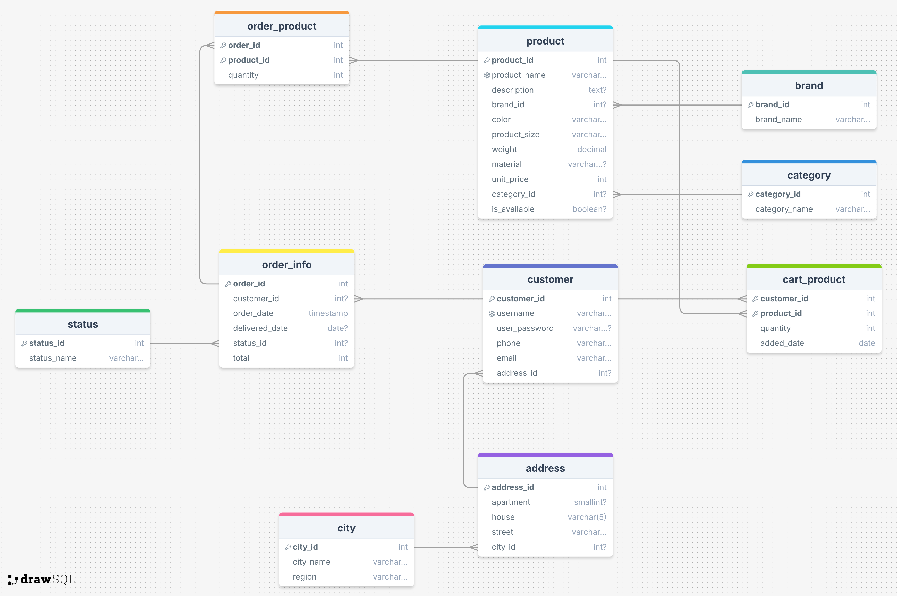
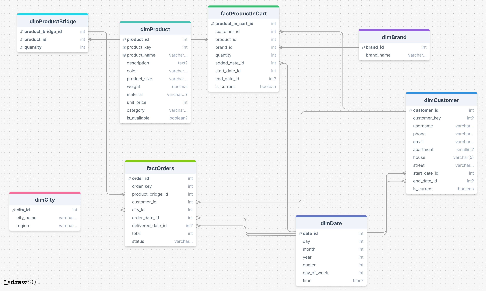

# DB Coursework: the creation of OLTP and OLAP databases for fitness products online shop
## OLTP:

1) Create the OLTP database
2) Run the OLTP.sql script in the OLTP database
3) Data for OLTP is stored in the following files: Products.csv and Orders.csv. Run ETL1.sql with the following command:
   ```
   $ psql -U <username> -d <database> -f ETL1.sql --set=products_path='pathTo/Products.csv' --set=orders_path='pathTo/Orders.csv'
5) There's also a Cart.csv file that stores initial data about users' carts. It's used only for the convenience of initial database filling, as the application cart would be modified by inserts, updates and deletes, not stored in CSV files. To fill the cart run ETL_cart.sql with the following command:
    ```
    $ psql -U <username> -d <database> -f ETL_cart.sql --set=cart_path='pathTo/Cart.csv'
## OLAP:

1) Create the OLAP database
2) Run the OLAP.sql script in the OLAP database
3) Open ETL2.sql and modify lines 6 and 9. In line 6 put the correct name of your OLTP database:
```
options (host '127.0.0.1', port '5432', dbname 'db_coursework'); 
```
In line 9 put the correct user and password:
```
options (user 'postgres', password 'postgres');
```
4) Run the ETL2.sql script in the OLAP database
